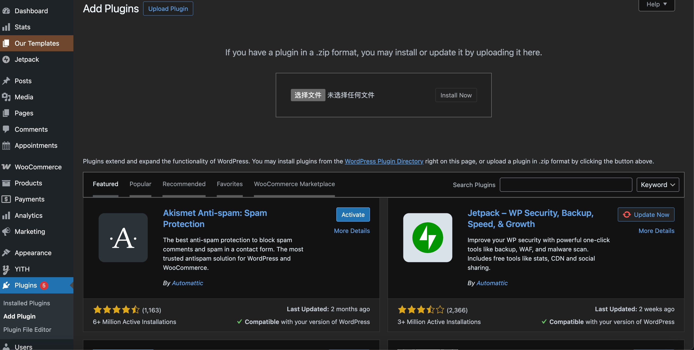
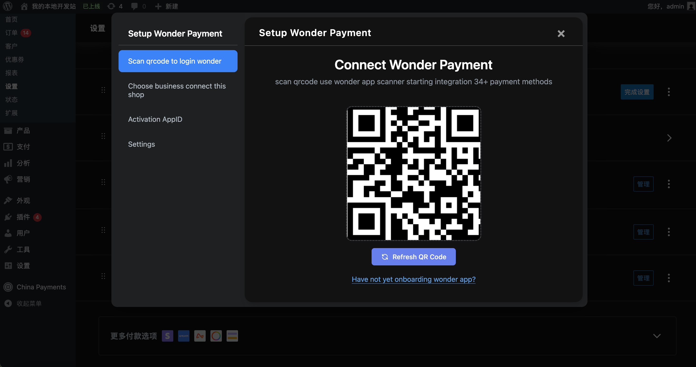
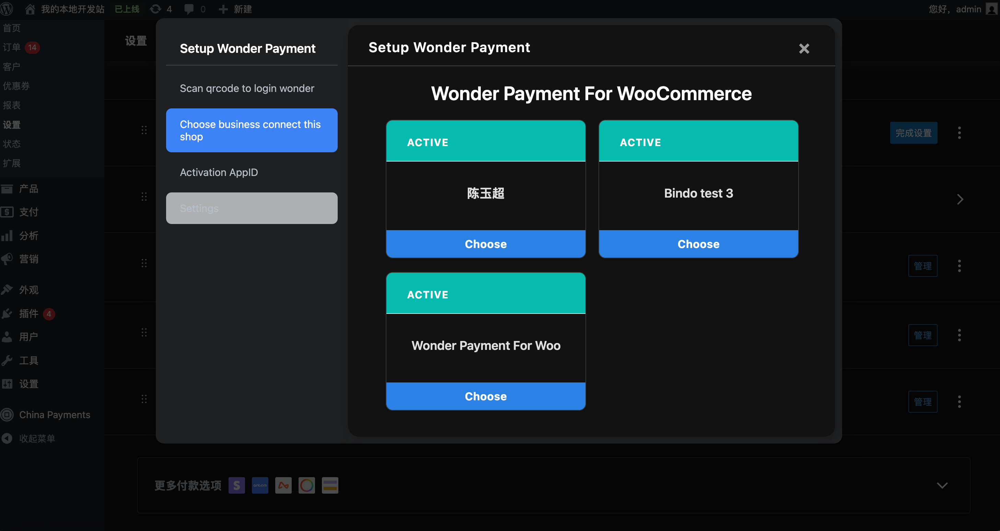
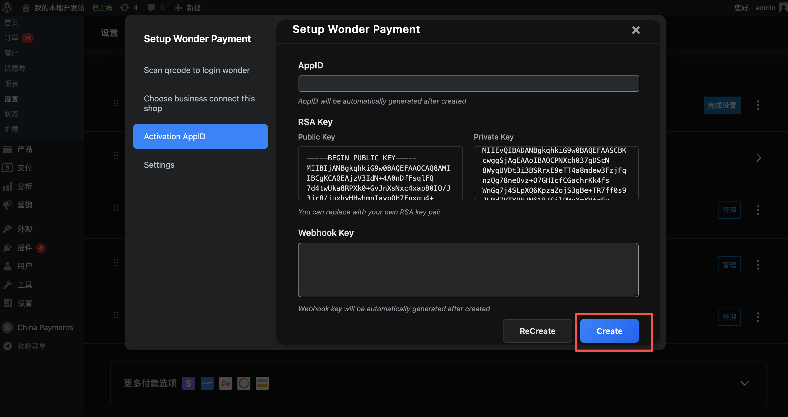
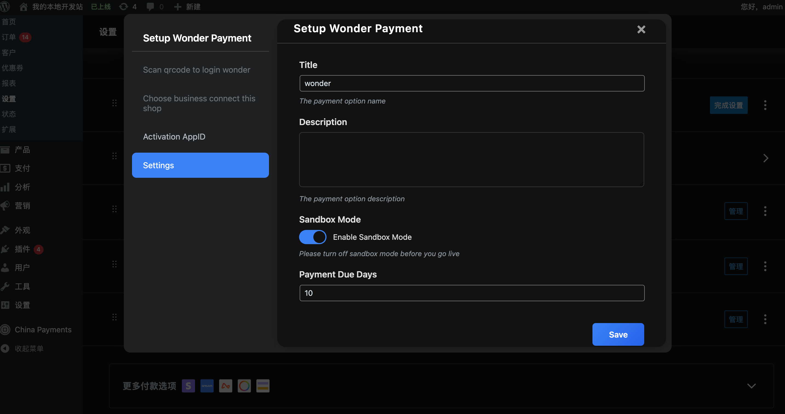
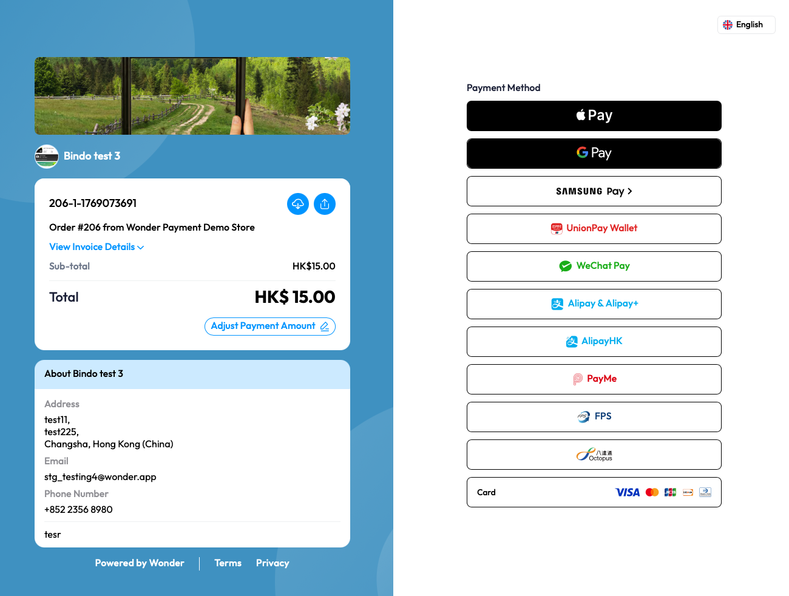
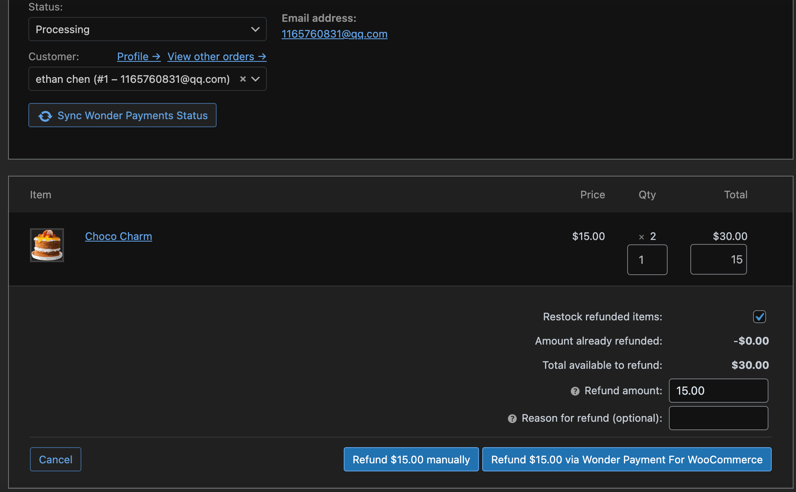

# Wonder Payments for WooCommerce

Setup guide for enabling Wonder Payments in WooCommerce.

## Setup Steps

1. Install
   - Download the zip package and upload it from the WooCommerce plugin install page.
   - 
2. Log in
   - Open the payment plugin admin page and log in by scanning the QR code.
   - 
3. Select a store
   - After login, choose the store to bind from the list.
   - 
4. Configure App ID and Webhook
   - On the Activation AppID page, Public Key and Private Key are generated automatically. Click Create to generate App ID and Webhook Key.
   - Click ReCreate to clear all configuration and return to the QR login page for a fresh login.
   - 
5. Save
   - Click Save in Settings to persist the configuration.
   - Title: payment option name.
   - Description: payment option description.
   - Sandbox Mode:
     - Enabled: uses the sandbox environment (no real transactions).
     - Disabled: uses the production environment (real payments).
   - Payment Due Days: payment due time window.
   - 
6. Payments
   - Wonder supports multiple payment methods.
   - 
7. Refunds
   - Wonder supports full and partial refunds, returning funds to the original payment method.
   - 
8. Sync Wonder Payments status
   - If webhook updates are delayed after payment or refund, use the Sync Wonder Payments Status button on the order page to sync manually.

## Notes

- App ID and private key must match, otherwise saving is rejected.
- After generating App ID or keys, you still need to click Save.
